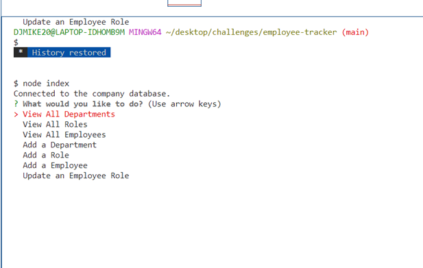
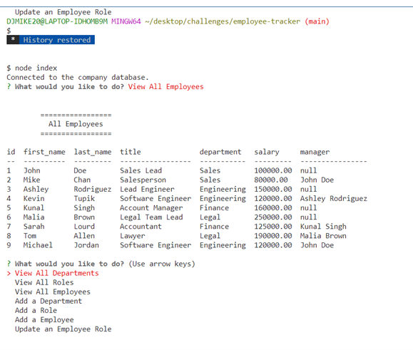
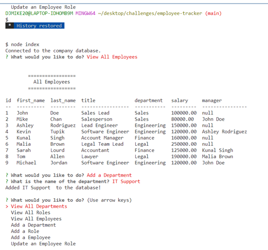
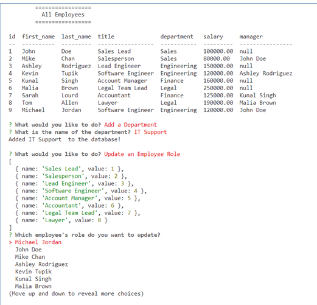

# employee-tracker

## Description
  An application that utilizes Node.js, Inquirer, MySQL to view and retrieve, add, update information for an Employee Database Tracker Application. The primary functionality of the application retrieves the data from the database and can be viewed within the terminal. The user is prompted with a series of questions and choices to exactly view,add or update the desired information. Ease of View and interact with information stored in databases using a content management system. 

## Table of Contents 
  * [Installation](#installation)
  * [Usage](#usage)
  * [Important-Links](#Important-Links)
  * [Questions](#questions)

  ## Installation
  * Ensure you are in your root folder,then open terminal and clone code from github. Then run these in the command terminal:

  * Next, run "npm init -y" to install packages 
  * MySQL2 Setup - "npm install --save mysql2"
  * Inquirer Setup - "npm i inquirer@8.2.4" 
  * Console Table Setup - "npm install console.table --save" 
  * Be sure to run the above packages in your terminal and include your require statements for your necessary files.
  * Don't forget to create your connections to the database using "const <databaseName> = mysql.createConnection()"

## Usage 
  Used to easily view and interact with information stored in a database. 
  * Firstly, open the terminal 
  * To activate the application start your server with "node index"
  * The application will run in the terminal and present a series of choices for the user to pick from using Inquirer
  * The user then can either view specific information from the database depending on the users choice. View all: Employees, Roles, Departments. Also have the option to add or update employee information: Add Employee, Add Employee Role, Add Department, Update Employee Role
  * When the user is satisfied with their selections or add/updates, they can exit the terminal using the short-cut on the keyboard : Ctrl + C

   

   
 
   
 
   

 ## Important Links 
* GitHub Link: https://github.com/MichaelZimm20/employee-tracker

* Video Demonstration Link: https://drive.google.com/file/d/1uagAwX-Oa7PEFLfEmoD5ImwICx20lsdV/view

## Questions 
  If you have any questions or concerns, contact:
  * GitHub: [MichaelZimm20](https://github.com/MichaelZimm20)
